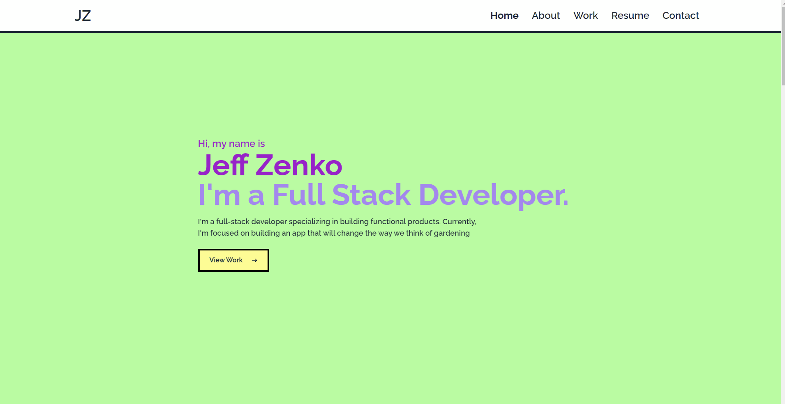

  # React Portfolio
  
  ## Table of Contents
  * [Description](#Description)
  * [Installation](#Installation)
  * [Usage](#Usage)
  * [Contribute](#Contribute)
  * [Test Instructions](#Test-Instructions)
  * [License](#License)
  * [Questions](#Questions)
  * [Future Development](#Future-Development)
  * [Credits](#Credits)

  ## Description
  Redid portfolio with React to learn front end aspects
  ## Installation
  Download repo and navigate to root directory and type npm install. Dependencies and everything is in the package.json file so it should all install automatically.
  ## Live Site
  

  ## License
  https://opensource.org/license/ecl-2-0/

  

  ## Questions
  If you have any questions, please contact me at jeff.zenko@gmail.com. You can also find me on GitHub at [codemodeactivate](https://github.com/codemodeactivate).
  ## Future Development
  I'll probably add a blog component and server side stuff for the contact form so I don't have to use a 3rd party. Also the acceptance criteria for this project was not exactly what I would have done. I ignored some of it, but the way the form handles is really annoying to users, in my opinion.
  ## Credits
  Inspiration: https://www.abhishekchoudhury.in/

  https://favicon.io/favicon-converter/

https://bootcamp.uxdesign.cc/how-can-i-design-in-the-neo-brutalism-style-d85c458042de

https://www.codewithfaraz.com/content/61/how-to-create-neobrutalism-sign-up-form-using-html-and-css-only
